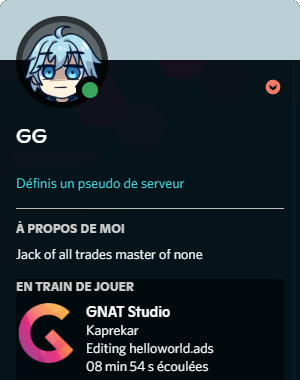

# GNAT Studio Discord Integration

This plugin will link GNAT Studio to Discord using Rich Presence.
It will show on which project you are working on and which file you are editing.
It will also show how many cards you have due and how long you've been on Anki for.

## Demo

<p align="center">
  
</p>

## Installation

- Clone the repo

```bash
  git clone https://github.com/Shinyhero36/GNAT-Studio-Discord-Integration
```

- Copy `rpc.py` to the plugins directory

    - On Windows: `C:\GNAT\2021\share\gnatstudio\plug-ins`
    - On IOS: IDK
    - On Linux: IDK

- Copy `discord.py` to the plugins directory

    - On Windows: `C:\GNAT\2021\share\gnatstudio\library`
    - On IOS: IDK
    - On Linux: IDK

- Activate the plugins
    - Open the IDE and go to Edit > Preferences > Plugins
    - Check discord
    - Restart the IDE
    - Enjoy !!


## Contributing

Contributions are always welcome!
